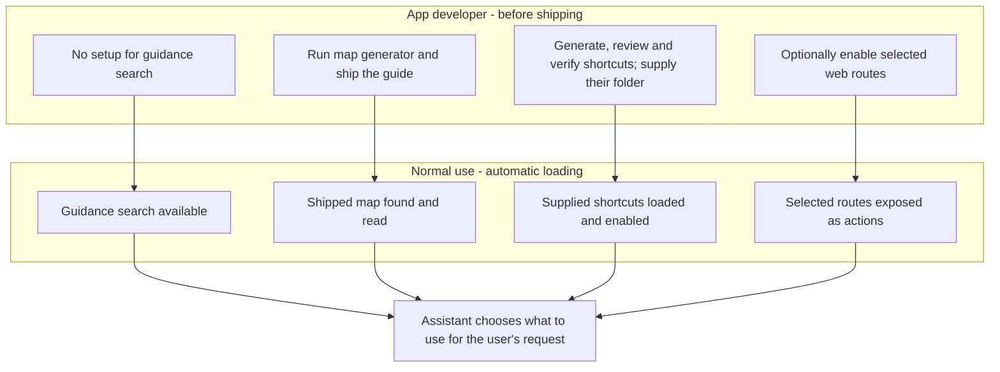

# ai-ify

Embed an AI agent inside any app. The person chats with it in a panel inside
the app (or opens a console on the same conversation); the agent runs on the
Claude or Codex subscription already logged in on the machine, and controls the
app only in the ways the app's developer allows: backend actions, named UI
commands, and an automatic tree of the page's controls.

## Install

```bash
pip install "ai-ify[web]"     # chat panel for FastAPI apps
pip install ai-ify            # control port and the aiify command only
```

Also needed: Node.js with `npx` (the first chat downloads the agent adapter, which
brings its own copy of Claude Code or Codex), and a Claude or ChatGPT subscription.
People who are not signed in get a "Sign in" card in the panel. No API key is used.

## Use

```python
from aiify import Agent, Profile
from aiify.actions import from_functions

agent = Agent(
    app="myapp",
    actions=from_functions({"notes.add": add_note, "notes.clear": clear_notes},
                           destructive=["notes.clear"]),
    profiles={"default": Profile(provider="claude")},
)
agent.mount(fastapi_app)          # chat panel + websocket + local control port
```

and in the page:

```html
<script src="/aiify/panel.js" defer></script>
```

The app can add its own context: rules on what the person typed or the model in use
(`When(prompt="cost", add_instructions=price_note)`), and buttons that start the
assistant with their own set-up (`launches={"explain": Launch(...)}`, then
`<button data-aiify-launch="explain">`). See `python -m aiify.context context`.
Hooks before and after each message, suggested prompts, locked pickers, one-off
questions from code (`await agent.ask(...)`), attachments, app notes, and queued or
scheduled messages are each one switch: `python -m aiify.context chat-options`.

Destructive actions show a "Run it?" card before they run. Agents (the embedded
one, or any other on the machine) reach the running app with the `aiify` command:
`aiify apps`, `aiify --app myapp action.list`, `aiify --app myapp ui tree`.

## Helper setup and defaults

Think of a toolbox: the developer packs it, and the assistant chooses which tool
to use for each request. The app developer ships the map and verified shortcuts
and permits web-route paths. People can change available helpers under **Controls**
in the shared panel, then start **New chat**. The switches preserve running tasks;
they do not generate assets or widen the app's permitted route paths.

| Helper | Developer setup | Default during normal use | Configuration |
|---|---|---|---|
| Local guidance search: finds instructions, actions and controls | None | Available automatically; the assistant chooses when to search | `how=True`; use `how=False` to disable |
| App map: guide to screens and tasks | Run the generator and ship `aiify_map.md` with the app package | Automatically finds a shipped map; adds its overview to the first message and makes its tasks searchable | `app_map="auto"`; use another file path or `None` to disable |
| Prepared actions: verified shortcuts into the app's functions | Generate, review, verify and ship the bundle; supply its folder | Loads and enables the supplied bundle when mounted; no automatic bundle discovery | `prepared=folder`; default `None` supplies no bundle |
| Web-route actions: callable versions of the app's web functions | Explicitly enable all routes or selected paths | Off until the developer opts in; selected routes are then discovered automatically | `routes=False`; opt in with `True` or a list such as `["/api/samples*"]` |



Generation is automated after the developer starts it. Reviewing, verifying,
rebuilding when the app changes, and packaging the generated files remain
release responsibilities. Neither maps nor shortcut bundles are generated during
ordinary chats. See the [discovery guide](src/aiify/guide/discovery.md) and
[preparation guide](src/aiify/guide/preparation.md) for the generation commands.

```python
from pathlib import Path
from aiify import Agent

# Defaults: guidance search on, shipped map auto-discovered, routes off.
agent = Agent("myapp")

# A host that ships reviewed, verified shortcuts supplies their folder.
agent = Agent("myapp", prepared=Path(__file__).parent / "aiify_prepared")

# Optional route actions; guidance and map defaults still apply.
agent = Agent("myapp", routes=["/api/samples*"])

# Explicitly disable the default discovery helpers; supply no shortcut bundle.
agent = Agent("myapp", how=False, app_map=None, prepared=None, routes=False)
```

The developer can use `agent.set_helpers(...)` to switch configured helpers off
and back on for the next chat, including `prepared=False` for a loaded bundle.
Routes must have been enabled when mounting, and maps and bundles must have been
supplied; this switch does not discover new bundles or generate missing files.
The defaults match the lowest-token tested Circadian Workbench configuration
when its map and verified shortcuts are supplied; other apps may differ.

## Documentation

- Usage guide, shipped with the package: `python -m aiify.context [topic]`, or
  `from aiify import context; print(context.read())`. Also as
  [README_AI.md](https://github.com/Jay2owe/ai-ify/blob/main/README_AI.md).
- [Embedding guide](https://github.com/Jay2owe/ai-ify/blob/main/docs/embedding-guide.md),
  with Circadian Workbench as the worked example.
- [Message format](https://github.com/Jay2owe/ai-ify/blob/main/docs/protocol.md).

## Development

```bash
python -m venv .venv
.venv/bin/python -m pip install -e ".[web,test]"     # Windows: .venv\Scripts\python.exe
.venv/bin/python -m pytest -m "not browser"          # browser tests need Edge or Playwright's Chromium
```

Releases are published by GitHub Actions when a `vX.Y.Z` tag matching the
package version is pushed ([RELEASING.md](https://github.com/Jay2owe/ai-ify/blob/main/RELEASING.md)).

Install name `ai-ify`, import name `aiify`. MIT licence. The bundled
`page-controller` (Alibaba, MIT) builds the page control tree.
