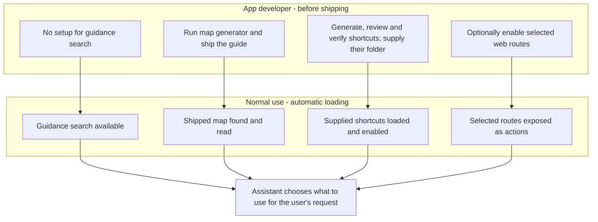

## What the agent finds by itself

The default uses local guidance search and an app map when one is shipped. A
verified bundle supplied by the host app starts enabled. Extra web-route actions
are opt-in. This matches the lowest-token configuration in the Circadian
Workbench evaluation; token use in other apps can differ.

## Who sets up each helper

The app developer configures these helpers before shipping. People using the app
just chat; the panel has no helper switches. Think of a toolbox: the developer
packs it, and the assistant chooses which tool to use for each request.

| Helper | Developer setup | Default during normal use | Configuration |
|---|---|---|---|
| Local guidance search: finds instructions, actions and controls | None | Available automatically; the assistant chooses when to search | `how=True`; use `how=False` to disable |
| App map: guide to screens and tasks | Run the generator and ship `aiify_map.md` with the app package | Automatically finds a shipped map; adds its overview to the first message and makes its tasks searchable | `app_map="auto"`; use another file path or `None` to disable |
| Prepared actions: verified shortcuts into the app's functions | Generate, review, verify and ship the bundle; supply its folder | Loads and enables the supplied bundle when mounted; no automatic bundle discovery | `prepared=folder`; default `None` supplies no bundle |
| Web-route actions: callable versions of the app's web functions | Explicitly enable all routes or selected paths | Off until the developer opts in; selected routes are then discovered automatically | `routes=False`; opt in with `True` or a list such as `["/api/samples*"]` |



Generation is automated after the developer starts it. Reviewing, verifying,
rebuilding when the app changes, and packaging the generated files remain
release responsibilities. Neither maps nor shortcut bundles are generated during
ordinary chats. The map generation commands are below; read `python -m aiify.context preparation`
for shortcut generation and verification.

```python
from pathlib import Path
from aiify import Agent

# Defaults: guidance search on, shipped map auto-discovered, routes off.
agent = Agent("myapp")

# A host that ships reviewed, verified shortcuts supplies their folder.
agent = Agent("myapp", prepared=Path(__file__).parent / "aiify_prepared")

# Optional route actions; guidance and map defaults still apply.
agent = Agent("myapp", routes=["/api/samples*"])

# Explicitly disable the default discovery helpers; supply no shortcut bundle.
agent = Agent("myapp", how=False, app_map=None, prepared=None, routes=False)
```

The developer can use `agent.set_helpers(...)` to switch configured helpers off
and back on for the next chat, including `prepared=False` for a loaded bundle.
Routes must have been enabled when mounting, and maps and bundles must have been
supplied; this switch does not discover new bundles or generate missing files.
The defaults match the lowest-token tested Circadian Workbench configuration
when its map and verified shortcuts are supplied; other apps may differ.

Routes that only read (GET) run freely. Every other method asks the person first,
like a destructive action. Routes are called inside the app's process.
`routes=["/api/samples*"]` offers only those paths.

A profile's `allow` and `deny` patterns apply to `route.*` names like any action.

## How the agent asks "how do I..."

The agent runs `aiify --app my-app how "export the summary as CSV"`. It gets the best
matches from everything above, each with how to use it: an action to run, a control
to click, or a section of the guide, README or app map. The search is local: no
tokens, no network, and no setup.

## The app map: built by the developer, once per release

A search finds the right pieces; it cannot explain a task that takes several
steps. The app map does that. It is a Markdown file of the app's screens, tasks
("How to ..." with numbered steps, by their on-screen labels) and terms. A hidden
conversation on the developer's own subscription reads the source and writes it:

```bash
python -m aiify.appmap build myapp.main:app          # or myapp.main:create_app, or the Agent
python -m aiify.appmap check myapp.main:app          # exit 1 when the source changed since
```

It writes `aiify_map.md` in the app's package folder. Ship that file with the
package, for example as package data. `Agent(app_map="auto")` finds it there
(`app_map="path"` points elsewhere).
The map's overview goes with the first message of each chat, and each task
becomes a `how` result.

The map records a fingerprint of the source. `how` reports `"app_map": "out of
date"` once the source has changed, and `check` fails, which suits a release
check or CI. Building it reads the source only: every tool that would change
something is refused. `--provider codex`, `--model` and `--effort` choose the agent.
A small app takes under a minute; a large one, several.

Success check: `python -m aiify.appmap check myapp.main:app` prints "is current", and
`aiify --app my-app how "<a task from the map>"` lists that task first.
